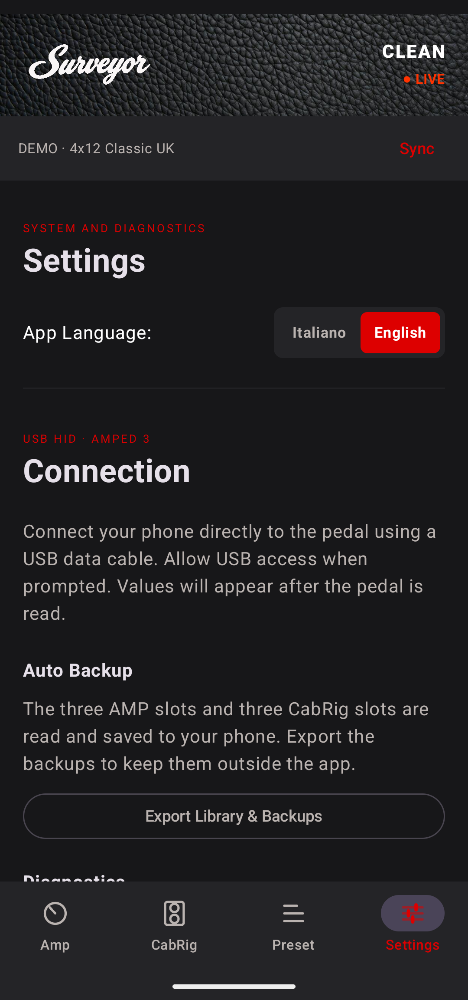

# Surveyor (Blackstar AMPED 3 Controller)

**Surveyor** is an open-source, mobile-first alternative to the official Blackstar "Architect" desktop software, specifically reverse-engineered and built for the **Blackstar AMPED 3** 100W pedal.

Born out of the frustration of needing a desktop PC to modify CabRig settings or deep EQ parameters, Surveyor gives you full USB-OTG control of your amplifier directly from your Android phone or tablet.

  <table>
    <tr>
      <td align="center"><b>Amp Controls</b> </td>
      <td align="center"><b>CabRig Settings</b> </td>
    </tr>
    <tr>
      <td align="center"><b>Preset Library</b> </td>
      <td align="center"><b>Settings & Sim</b> </td>
    </tr>
  </table>

---

## 🎸 Features

- **Live USB-OTG Sync:** Connect your Android device directly to the AMPED 3 via USB. Bidirectional syncing means moving a physical knob on the amp instantly updates the app, and dragging a slider on the app instantly updates the amp.
- **CabRig Deep Dive:** Access hidden parameters not available on the physical pedal. Swap between all 23 cabinets (plus DI), 6 microphones, toggle Axis, Stereo Width, Room Type, and master levels.
- **Complete Cab/Mic Matrix:** The app includes all 288 DSP profiles exposed by Architect: 24 cabinet/DI choices × 6 microphones × On/Off Axis. Every profile was captured from Architect and validated as one header plus five complete DSP chunks.
- **Logarithmic EQ Sweeps:** The Low-Cut and High-Cut filters have been mathematically mapped to display actual, usable frequencies (Hertz) instead of raw 0-255 MIDI values (e.g., Low-Cut from 20Hz to 400Hz).
- **Physical "Tolex" Aesthetic:** The UI mimics the physical head. When you adjust the Gain, watch the slider track heat up with an intense, glowing tube-valve gradient!
- **Preset Management (.amped & .cabrig):** Import official XML patches from Architect Desktop directly into your phone. Burn them into the 3 hardware slots, or keep an unlimited number of patches stored locally on your device!

---

## 🛠️ The Reverse Engineering Journey (Protocol Documentation)

The AMPED 3 uses a proprietary chunked USB HID protocol. Through packet capture and custom Python tools, the project reconstructs the messages needed by the controller.

This section outlines the reverse-engineered USB HID communication protocol for the Blackstar AMPED 3 pedal, primarily interacting via firmware version 1.03 as sniffed from Architect 2.1.3.

### Overview

The AMPED 3 uses 64-byte USB HID reports (VID `27d4`, PID `0072`).
Communication consists of:
- **`0x16` Commands:** Standard Amplifier parameters (Gain, EQ, ISF, Master).
- **`0xa9` Commands:** CabRig individual parameters (Cut filters, Room levels).
- **`0xaa`, `0xab`, `0xac` Commands:** Bulk IR/DSP profile transfers for Cabinets and Microphones.

### Core Message Structure

A standard parameter set command is formatted as follows:
`[CMD] [OFFSET_LOW] [OFFSET_HIGH] [COUNT] [VALUE_1] ... [VALUE_N] [PADDED_ZEROS]`

Example for setting an AMP parameter:
`16 00 00 01 7F` -> Command `16` (Amp), Offset `00` (Gain), Count `1`, Value `7F` (127).

Example for setting a CAB parameter:
`a9 39 00 01 7F` -> Command `a9` (CabRig), Offset `39` (57 = Room Level), Count `1`, Value `7F` (127).

### Amp Parameters (`0x16`)

These map 1:1 to the physical knobs on the pedal, with values ranging `0x00` (0) to `0x7f` (127):

| Offset (Dec) | Offset (Hex) | Parameter Name | Range |
|--------------|--------------|----------------|-------|
| 0            | 0x00         | Gain           | 0-127 |
| 1            | 0x01         | Bass           | 0-127 |
| 2            | 0x02         | Middle         | 0-127 |
| 3            | 0x03         | Treble         | 0-127 |
| 4            | 0x04         | ISF            | 0-127 |
| 5            | 0x05         | Response/Power | 0-127 |
| 6            | 0x06         | Master Volume  | 0-127 |

*Note: There are other offsets (7, 8, 9) involved in reverb, presence, and resonance depending on the specific patch or hidden Architect parameters.*

### CabRig Parameters (`0xa9` and Bulk)

CabRig is handled differently. Architect generates a 260-byte DSP coefficient profile for each cabinet/microphone/axis choice. It is not raw audio or a conventional sampled IR. Architect sends it with a bulk transfer (`aa`, `ab`, `ac` reports); saving the Cab slot is a separate operation.

The checked-in `cab_profiles.json` contains the complete 24 × 6 × 2 matrix. `tools/extract_cab_profiles.py` rebuilds the asset from a HID capture and refuses to produce an output unless all 288 combinations are present with the expected `AB 0..4` request sequence and five 64-byte `AC` chunks.

However, some specific post-EQ parameters can be manipulated individually via `0xa9` without a bulk transfer:

| Offset (Dec) | Offset (Hex) | Parameter Name     | Range   | Notes |
|--------------|--------------|--------------------|---------|-------|
| 57           | 0x39         | Room Level         | 0-127   | Maxes out at 0x7F! |
| 67           | 0x43         | High-Cut Frequency | 0-255   | 0 = 2kHz, 255 = 20kHz (Logarithmic) |
| 83           | 0x53         | Low-Cut Frequency  | 0-255   | 0 = 20Hz, 255 = 400Hz (Logarithmic) |
| 66           | 0x42         | Low-Cut Toggle     | 0-1     | 0 = Off, 1 = On |
| 82           | 0x52         | High-Cut Toggle    | 0-1     | 0 = Off, 1 = On |

*Important discovery: Do not send values > 127 to the Room Level offset (57), as the physical DSP clips at 127 (`0x7F`). Surveyor handles this internally to prevent DSP overflow.*

### Hardware Interaction & Slot Switching
To change channels (slots), send `0x11` (Amp slots) or `0x01` (Cab slots) encapsulated in a `0x02` (System) command:
- `02 11 01 00` -> Change to AMP Slot 1 (Clean)
- `02 01 02 00` -> Change to CAB Slot 2

---

## 🚀 Installation

You don't need Android Studio or a PC to install Surveyor! 

1. Go to the **[Releases](../../releases/latest)** page on this GitHub repository.
2. Download the latest `Surveyor-vX.X.X.apk` file directly to your Android device.
3. Open the downloaded APK and tap **Install** (you may need to allow "Install from Unknown Sources" in your Android settings).
4. Connect your AMPED 3 pedal to your phone using a USB-C OTG cable.
5. Open Surveyor and grant USB permissions when prompted. You're ready to rock!

*(For developers: You can clone this repository and build it locally using Android Studio and `./gradlew assembleDebug`).*

---

## ⚠️ Disclaimer

*Surveyor is an independent, community-driven project and is in no way affiliated with, endorsed by, or supported by Blackstar Amplification. Use at your own risk.*
