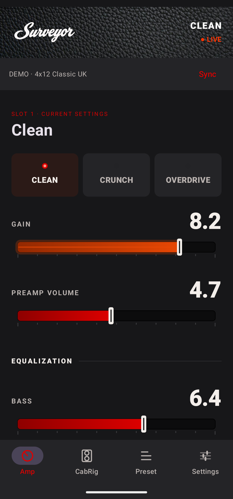
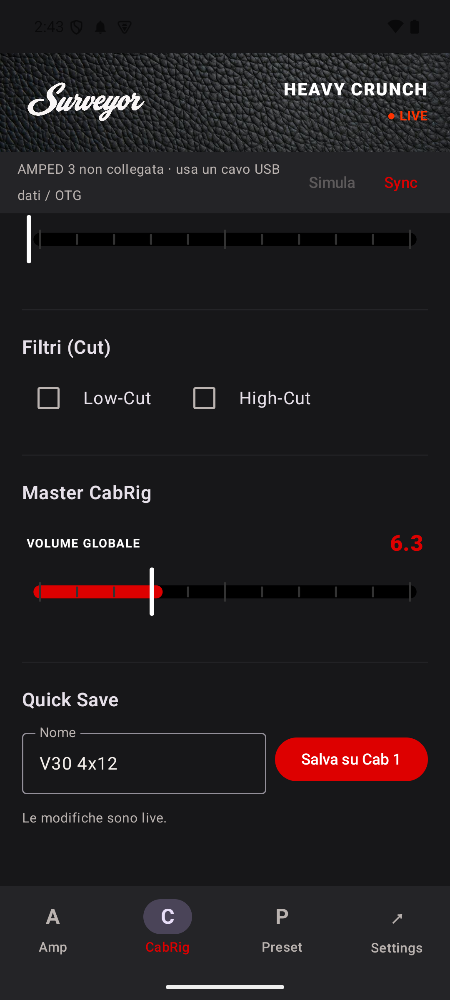
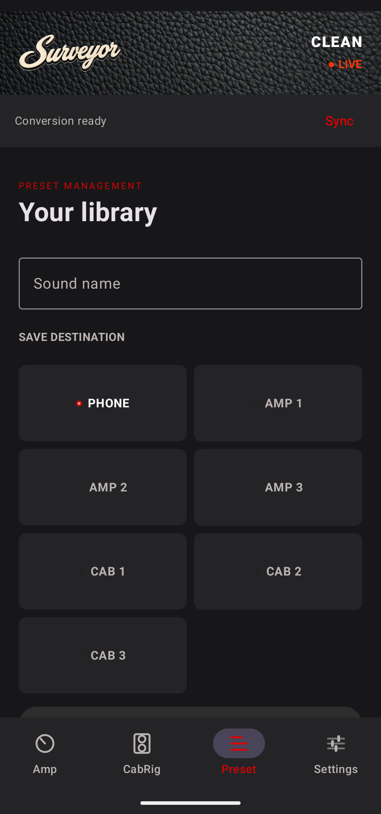

# Surveyor (Blackstar AMPED 3 Controller)

**Surveyor** is an open-source, mobile-first alternative to the official Blackstar "Architect" desktop software, specifically reverse-engineered and built for the **Blackstar AMPED 3** 100W pedal.

Born out of the frustration of needing a desktop PC to modify CabRig settings or deep EQ parameters, Surveyor gives you full USB-OTG control of your amplifier directly from your Android phone or tablet.

<div align="center">
  <br><br>
  <br><br>
  
</div>

---

## 🎸 Features

- **No Desktop PC Required:** Connect your Android device directly to the AMPED over USB-OTG. The app reads the amp's actual state on connect and re-reads it after every write, so the controls show hardware values instead of assumed ones. Round-trip latency has not been measured, and not every physical knob reports its movement on its own, so a manual resync covers that case.
- **CabRig DSP Protocol Decoded:** Surveyor ships all 288 factory CabRig DSP profiles, extracted from captures of my own unit and validated against both checksum layers. I decoded the 260-byte payload format itself: it is a 16-section recursive filter cascade described by 65 float32 values, not a convolution of a stored impulse response.
- **Custom Profile Tools (experimental):** The offline Python tool `tools/cabrig_dsp.py` builds structurally valid non-factory profiles: it rebuilds both checksum layers, verifies pole stability after float32 quantisation, and its `--fit-ir` mode fits a WAV impulse response by solving the 33 numerator weights over the fixed pole bank of a factory profile. The resulting packets are valid by construction; their sound has not been measured yet, so treat fitted profiles as an experiment, not a feature.
- **Deep Parameter Control:** Access DSP parameters that the pedal itself does not expose, with the parameter map verified against the hardware rather than assumed ([docs/PROTOCOL_VERIFICATION.md](docs/PROTOCOL_VERIFICATION.md)). The Low-Cut and High-Cut controls are shown in approximate hertz rather than as raw 0-255 values; Architect itself displays only a 0-10 position, so those figures are an estimate and are printed with a leading `~`.
- **Guarded Preset Management:** The hardware slot saving sequence is documented and exercised. Before writing, Surveyor reads the destination slot and fsyncs a local backup; after writing it waits for the acknowledgement, rereads the slot and compares name and data, and reports an explicit unconfirmed-save status if any of those steps fails. Current coverage and its limits are in [docs/STORAGE_VERIFICATION.md](docs/STORAGE_VERIFICATION.md): CabRig verification covers all 84 bytes, AMP verification covers the first nine continuous parameters, and a power-cycle retention test is still pending.

---

## 🛠️ The Reverse Engineering Journey (Protocol Documentation)

The AMPED 3 uses a proprietary chunked USB HID protocol. Through packet capture and custom Python tools, the project reconstructs the messages needed by the controller.

This section outlines the reverse-engineered USB HID communication protocol for the Blackstar AMPED 3 pedal, primarily interacting via firmware version 1.03 as sniffed from Architect 2.1.3.

### Overview

The AMPED 3 uses 64-byte USB HID reports (VID `27d4`, PID `0072`).
Communication consists of:
- **`0x16` Commands:** Standard Amplifier parameters (Gain, EQ, ISF, Master).
- **`0xa9` Commands:** CabRig individual parameters (Cut filters, Room levels).
- **`0xaa`, `0xab`, `0xac` Commands:** Bulk IR/DSP profile transfers for Cabinets and Microphones.

### Core Message Structure

A standard parameter set command is formatted as follows:
`[CMD] [OFFSET_LOW] [OFFSET_HIGH] [COUNT] [VALUE_1] ... [VALUE_N] [PADDED_ZEROS]`

Example for setting an AMP parameter:
`16 00 00 01 7F` -> Command `16` (Amp), Offset `00` (Gain), Count `1`, Value `7F` (127).

Example for setting a CAB parameter:
`a9 39 00 01 7F` -> Command `a9` (CabRig), Offset `39` (57 = Room Level), Count `1`, Value `7F` (127).

### Amp Parameters (`0x16`)

These are the continuous parameters of the 52-byte live AMP block, each a single byte from `0x00` (0) to `0x7f` (127). Some correspond to a physical knob, others exist only in Architect:

| Offset (Dec) | Offset (Hex) | Parameter Name  | Range |
|--------------|--------------|-----------------|-------|
| 0            | 0x00         | Gain            | 0-127 |
| 1            | 0x01         | Preamp Volume   | 0-127 |
| 2            | 0x02         | Boost Level     | 0-127 |
| 3            | 0x03         | Reverb Level    | 0-127 |
| 4            | 0x04         | Bass            | 0-127 |
| 5            | 0x05         | Middle          | 0-127 |
| 6            | 0x06         | Treble          | 0-127 |
| 7            | 0x07         | ISF             | 0-127 |
| 8            | 0x08         | Presence        | 0-127 |
| 9            | 0x09         | Master Volume   | 0-127 |

All ten were **verified on the hardware on 20 September 2026** by reading the ten knob values Architect displays and matching them against the pedal's own 52-byte live block: each knob was compatible with exactly one offset, with every residual below half a step, and nothing was written to the amp to establish it. The method and the residuals are in [docs/PROTOCOL_VERIFICATION.md](docs/PROTOCOL_VERIFICATION.md).

Switch offsets, each confirmed against what Architect showed at the same moment:

| Offset (Dec) | Offset (Hex) | Parameter        | Observed values |
|--------------|--------------|------------------|-----------------|
| 21           | 0x15         | Power            | 1 = 100 W confirmed; 2 and 3 are 1 W / 20 W in some order |
| 22           | 0x16         | Response (valve) | 1 = 6L6, 2 = EL84, 3 = EL34 |
| 24           | 0x18         | Boost Position   | 0 = Post, 1 = Pre |
| 25           | 0x19         | Reverb Character | 0 = Light, 1 = Dark |
| 26           | 0x1a         | Clean Voice      | 0 = Bright, 1 = Warm |
| 27           | 0x1b         | Crunch Voice     | 0 = Super Crunch, 1 = Crunch |
| 28           | 0x1c         | OD Voice         | 0 = OD2, 1 = OD1 |
| 32           | 0x20         | Channel + boost  | Bit 6 (64) is Boost, writable and verified. The low bits track the channel; 1, 8 and 32 were all observed and the encoding is not settled |
| 33           | 0x21         | Reverb on/off    | 0 or 1 |

Power is not exposed in the UI because only the 100 W value is pinned down. Offsets 10, 23, 40 and 41 hold unidentified state; 32 and 41 ignore writes and report values of the amp's own choosing. Preset import restores the continuous parameters, response and the two character switches, and skips channel/voice selection — the code says so explicitly rather than pretending otherwise.

### CabRig DSP Format & Custom IRs (`0xaa` Bulk Transfers)

CabRig is handled entirely differently from standard Amp parameters. By capturing the USB traffic of my own unit and disassembling the coefficient routine of the JUCE-based Architect binary, I reconstructed the CabRig DSP format.

**The most significant discovery is that CabRig does NOT use conventional WAV Impulse Responses (IR) or long FIR convolution.**

Instead, Architect generates a highly optimized **260-byte DSP coefficient profile** for each cabinet/microphone/axis choice. It sends this to the amp via a bulk transfer of one `0xaa` header plus five `0xac` chunks. Every report is 64 bytes and carries a big-endian **CRC-16/XMODEM** of its own payload in bytes 1-2 and that payload's length in byte 3, with data from byte 4. The header additionally carries the CRC of the reassembled 260 bytes in little-endian order, the length 260, and the chunk count 5. All 288 captured profiles pass both levels.

#### The 65-Float Biquad Cascade
The 260-byte payload consists entirely of **65 little-endian float32 values**:
- 1 direct coefficient (gain/scaling).
- 16 compact second-order recursive-filter sections (IIR Biquads) (16 sections × 4 floats = 64 floats).

This is consistent with the pedal's low latency: sixteen biquads in cascade approximate the magnitude response and the resonances of a cabinet for a small fraction of the cost of a convolution, and give up the long room tail in exchange. Supporting evidence from the binary: it contains `DSP_BLOCK_BiquadFilter_init`, `DSP_Block_BiquadFilter.c` and `CabRigCoeffsBase`, and the disassembled conversion routine caps at sixteen sections of four input floats each.

#### Custom profiles from an IR (experimental)

The pedal has no convolution engine, so there is no such thing as uploading a WAV to it. What the decoded format makes possible is computing a cabinet's worth of coefficients yourself, which is the useful half of the same wish. The approach is plain system identification against a fixed pole bank:

1. Start from a factory profile and keep its denominators, which are the part that determines stability.
2. Transform the target WAV impulse response and solve, by complex least squares, for the 33 real numerator weights: one direct term plus two per section.
3. Re-derive the poles from the quantised float32 result and refuse to emit anything whose poles left the unit circle.
4. Rebuild both checksum layers so the amp accepts the packet.

`tools/cabrig_dsp.py` does all four steps offline and never opens the USB device. Because step 1 never touches the denominators, the fit cannot produce an unstable filter; that is a structural guarantee about the filter, not a claim about how it sounds. The tool reports the relative complex fit error and the predicted peak gain in dB, and marks its own output `hardware_audio_validation: false`.

```bash
python3 tools/cabrig_dsp.py app/src/main/assets/cab_profiles.json --key 21:5:0 --fit-ir mycab.wav --output /tmp/custom-cab.json
```

What is not yet established: the 48 kHz sample rate is an assumption the tool labels as such, not a rate read off the hardware, and the section ordering, summation topology and gain normalisation are inferred from the disassembly and the payload layout rather than confirmed by a measured sweep. A pole bank borrowed from one cabinet also cannot represent an arbitrary long-delay impulse response however well the numerators are solved, so this is a tool for cabinet and EQ curves, not a general IR loader. Back up all six slots first, load into the live DSP only, and restore without saving if anything sounds or measures wrong. See [docs/CABRIG_DSP_FORMAT.md](docs/CABRIG_DSP_FORMAT.md) for the full account.

The checked-in `cab_profiles.json` contains the complete factory 24 × 6 × 2 matrix (288 choices, 276 distinct payloads, since a few choices intentionally share data).

However, some specific post-EQ parameters can be manipulated individually via `0xa9` without a bulk transfer:

| Offset (Dec) | Offset (Hex) | Parameter Name     | Range   | Notes |
|--------------|--------------|--------------------|---------|-------|
| 57           | 0x39         | Room Level         | 0-127   | Maxes out at 0x7F! |
| 3            | 0x03         | Cabinet Level      | 0-127   | ±12 dB; not exposed in the app yet |
| 65           | 0x41         | Master Level       | 0-255   | |
| 66           | 0x42         | Low-Cut Toggle     | 0-1     | 0 = Off, 1 = On |
| 67           | 0x43         | **Low-Cut Frequency**  | 0-255   | Rises with the value; the hertz the app prints are an uncalibrated estimate |
| 70, 73, 77, 81 | –          | EQ Low, Low Mids, High Mids, High | 0-255 | dB = (raw − 127.5) / 12.75, which reproduces all four Architect readouts |
| 82           | 0x52         | High-Cut Toggle    | 0-1     | 0 = Off, 1 = On |
| 83           | 0x53         | **High-Cut Frequency** | 0-255   | Falls as the cut gets more aggressive; same estimate caveat |

*The two cut frequencies were swapped in this document and in the app until 20 September 2026: the control labelled Low-Cut wrote offset 83. Moving one Architect control at a time with the traffic captured showed which is which, and the factory EQ presets agree — "Cocked Wah" keeps only midrange with 67 at 255 and 83 at 17. Architect never displays a frequency, only a 0-10 knob position, so the hertz values shown in the app are a plausible mapping, not a measured one.*

*Observed behaviour: the Room Level offset (57) stops responding above 127 (`0x7F`) even though the field is a byte, so Surveyor clamps it there rather than sending values the DSP ignores.*

### Hardware Interaction & Slot Switching
To change channels (slots), send `0x11` (Amp slots) or `0x01` (Cab slots) encapsulated in a `0x02` (System) command:
- `02 11 01 00` -> Recall AMP Slot 1 (Clean). Verified independently: after sending it for slot 2 the live parameters became exactly that slot's stored bytes, while Master stayed put because the 15-byte stored format does not include it. That format is bytes 0-8 of the live block in order, then power at byte 10 and valve response at byte 11.
- `02 01 02 00` -> Change to CAB Slot 2. Present in the captures (`research/eq_sniff.log`) but not yet exercised on its own outside Architect, so treat it as observed rather than verified.

Architect pads these reports with an uninitialised tail beyond the declared length. Do not copy those bytes: send zero padding.

---

## 🚀 Installation

1. Go to the **[Releases](../../releases/latest)** page on this GitHub repository.
2. Download the latest `Surveyor-vX.X.X.apk` file directly to your Android device.
3. Open the downloaded APK and tap **Install** (you may need to allow "Install from Unknown Sources" in your Android settings).
4. Connect your AMPED 3 pedal to your phone using a USB-C OTG cable.
5. Open Surveyor and grant USB permissions when prompted. You're ready to rock!

*(For developers: You can clone this repository and build it locally using Android Studio and `./gradlew assembleDebug`).*

---

## ⚠️ Disclaimer

*Surveyor is an independent, community-driven project and is in no way affiliated with, endorsed by, or supported by Blackstar Amplification. Use at your own risk.*
